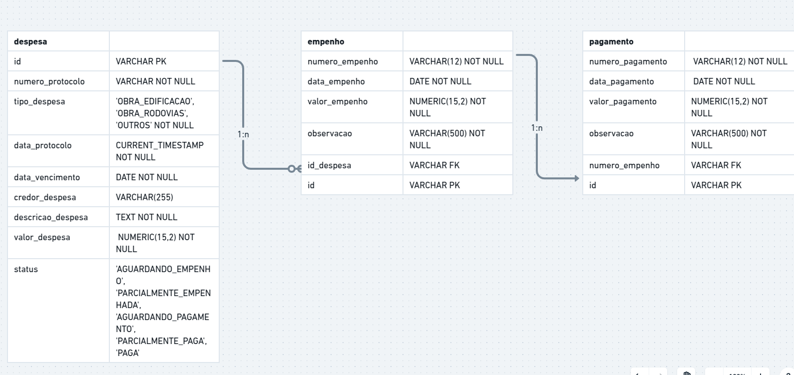

# Api Java Projeto SOP

Teste para a vaga da Superintendência de Obras Públicas.

## Configurações e Observações

1. Java 17
2. Criado docker-compose.yml para criar a imagem e um container PostgreSql para um banco de teste na aplicação. Verifique as credenciais no arquivo docker-compose.yml e application.properties.

Para subir o container execute o comando na raiz do projeto

```yaml
docker compose up -d
```

3. Para criar diretamente as tabelas adicione spring.jpa.hibernate.ddl-auto=update no arquivo application.properties. Caso deseje criar com os scripts, segue o mesmo no arquivo scripts.sql

## Uso

1. Inicie a aplicação com o Maven
2. A api está acessível em http://localhost:8080

## Diagram entidade relacionamento



Segue o link -> https://whimsical.com/sop-NiAHQkkM2CtgayhsXBz9C6

## Considerações sobre o projeto

### Design Pattern

Foi adotado a utilização de DTOS, quando necessário. Será visto que em alguns momentos as próprias entidades foram utilizadas.

Também houve a separação dos arquivos de forma modular. Cada entidade representa um módulo.
Para cada módulo existe os controllers, o services (regras de negócio), repositories, entities e dtos. Apesar da criação de vários arquivos, torna a arquitetura simples e deixa o código mais legível, sendo que cada um tem poucas responsabilidades.


### Observações

Em cada tabela foi adicionado o campo id. Possivelmente número de protocolo, número de empenho e número de pagamento serviriam como identificador de tuplas. Entretanto, surgiram alguns contrapontos. 
O formato "anoAtual" + "NE" + "sequencial de 4 dígitos" para número de empenho pode resultar em erro quando surjam empenhos acima de sequencial 9999 para o mesmo ano. Como implementação básica do projeto, doi feito o soclitado, mas, em ambiente de produção resultaria em problemas. O mesmo vale para pagamento. Como houve dúvida sobre este campo, adicionei o campo id para essas tabelas. Despesa seguiu o padrão.

Para numerais únicos, o mais apropriado é a utilização de sequenciais.


### Melhorias

1. Implementar autenticação e autorização. O arquivo WebConfig liberou muitas permissões para fim de testes. 

2. Foi respeitdado os requisitos do documento, contudo, é apropriado que cada tabela tenha registros de criação, edição, data e quem executou estas ações. Isso é importante para auditoria.

3. Implementação de testes.

4. Documentação da api.

5. Entre outras
